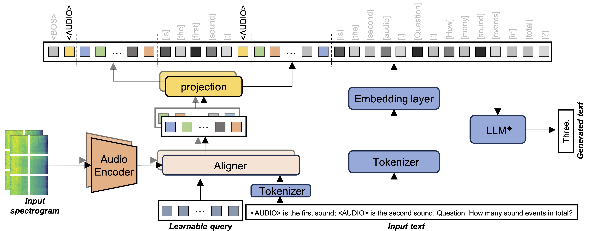

# Acoustic Prompt Tuning: Empowering Large Language Models with Audition Capabilities
This repository contains the official implementation of "Acoustic Prompt Tuning: Empowering Large Language Models with Audition Capabilities".

We introduce APT, an audio adapter that extend LLMs/VLMs to the audio domain by soft prompt tuning. APT-enhanced LLMs (namely APT-LLMs) demonstrate a strong audio understanding capacity in several audio downstream tasks, such as audio captioning, few-shot audio classification, and natural language audio reasoning.

## TODO
- [x] APT inference code release.
- [x] APT training code release.
- [ ] APT model and checkpoint release.
- [ ] Natural language audio reasoning database release.

## Special Thanks
Part of the code is borrowed from the following repos. We would like to thank the authors of these repos for their contribution.  
https://github.com/salesforce/LAVIS  
https://github.com/LAION-AI/CLAP  
https://github.com/microsoft/unilm/tree/master/beats  
https://github.com/facebookresearch/AudioMAE  

## Reference
If you find this work is helpful in your research, please cite our paper:  
@ARTICLE{10852359,  
  author={Liang, Jinhua and Liu, Xubo and Wang, Wenwu and Plumbley, Mark D. and Phan, Huy and Benetos, Emmanouil},  
  journal={IEEE Transactions on Audio, Speech and Language Processing},   
  title={Acoustic Prompt Tuning: Empowering Large Language Models With Audition Capabilities},   
  year={2025},  
  volume={33},  
  number={},  
  pages={949-961},  
  keywords={Acoustics;Visualization;Training;Adaptation models;Cognition;Natural languages;Large language models;Feature extraction;Spectrogram;Speech processing;Audio recognition;audio understanding;audio-language learning;automated audio captioning;large language model;natural language audio reasoning},  
  doi={10.1109/TASLPRO.2025.3533375}  
}